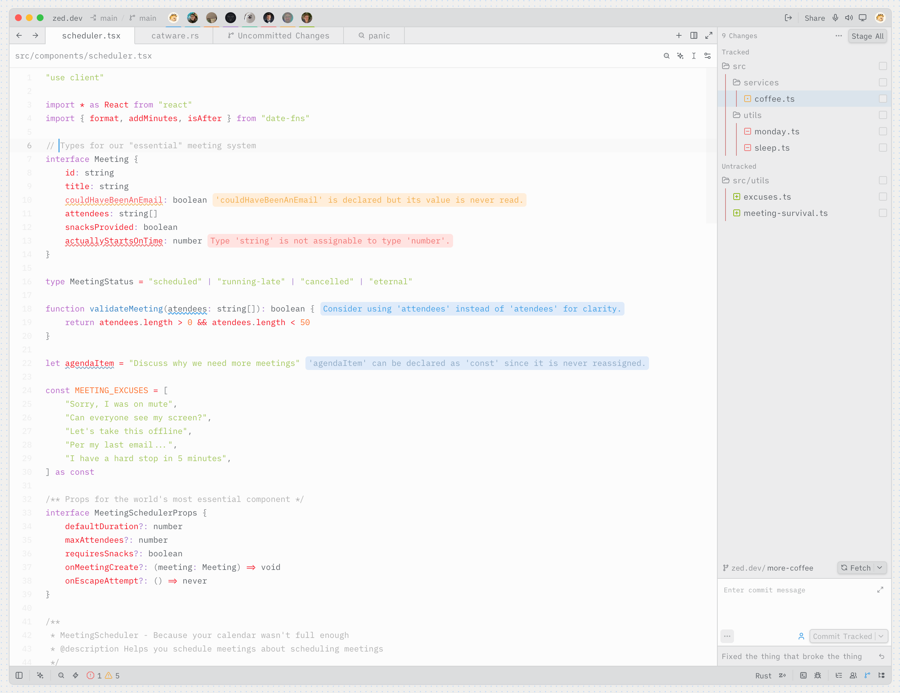

# Bamboo for Zed

A light theme with a dark terminal for Zed.

Pairs well with the [Bamboo Icon Theme for Zed](https://github.com/chrisdrackett/bamboo-icon-theme-zed).

## Development

1. Open Zed's command palette and run `zed: install dev extension` (also available as **Install Dev Extension** on the Extensions page).
2. Select this repository's root directory, which contains `extension.toml`.
3. Run `theme selector: toggle` and select **Bamboo Light**.

Alternatively, copy `bamboo-theme-zed` into `~/.config/zed/themes/` and select **Bamboo Light** in the theme selector. Create that directory if it does not exist.
